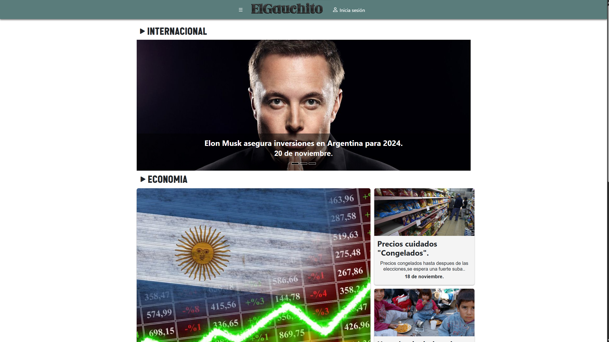
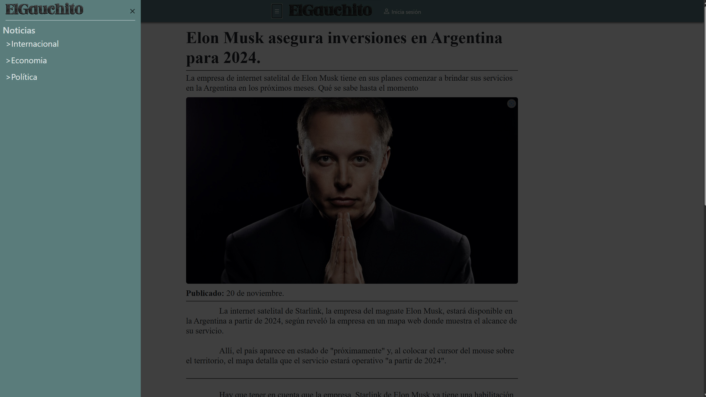
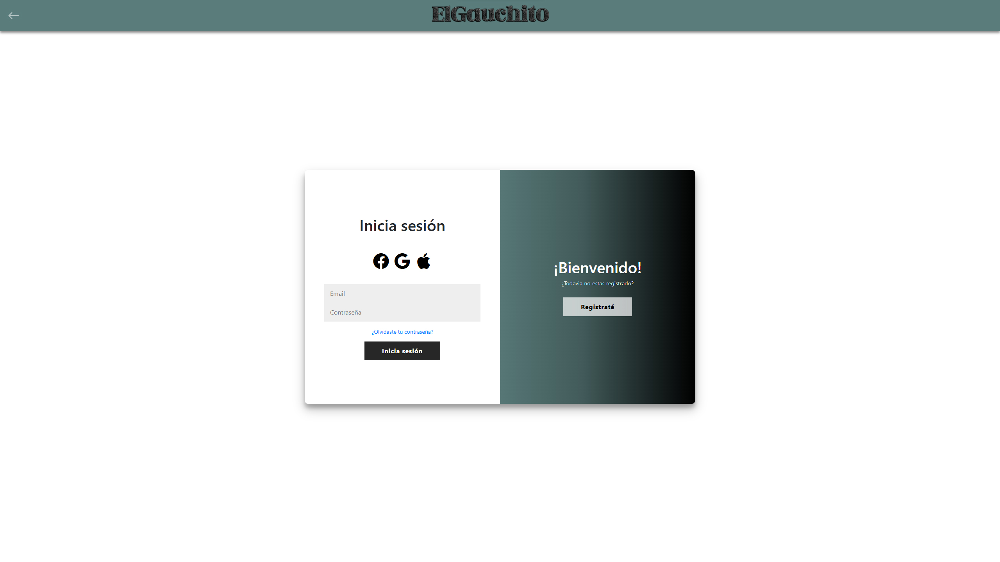

# 📰 Pagina web de Noticias ElGauchito

Link : [ElGauchito](https://leonelmoyanocode.github.io/elgauchito)

Descripción: Este proyecto consiste en el desarrollo de un portal de noticias responsivo que ofrece a los usuarios la posibilidad de registrarse, iniciar sesión y navegar por diversas noticias. La página principal presenta un menú de navegación, secciones destacadas y una lista de noticias que, al ser seleccionadas, dirigen a páginas individuales con el contenido completo.

# Página de Inicio (index.html):

* Menú de Navegación: Acceso a diferentes secciones del portal, como Categorías de noticias.
* Noticias Destacadas: Presentación de las noticias más relevantes con imágenes y resúmenes.

# Pagina de logeo y registro (login.html)

* Permite a los usuarios registrarse o logearse,es solo visual.

#🛠️ Tecnologías Utilizadas

* HTML5: Estructura semántica de las páginas.
* CSS3: Estilos y diseño responsivo para una experiencia óptima en diversos dispositivos.
* JavaScript: Funcionalidades interactivas como validación de formularios y manejo de eventos.
* Bootstrap: Framework para facilitar el diseño responsivo y componentes predefinidos.
